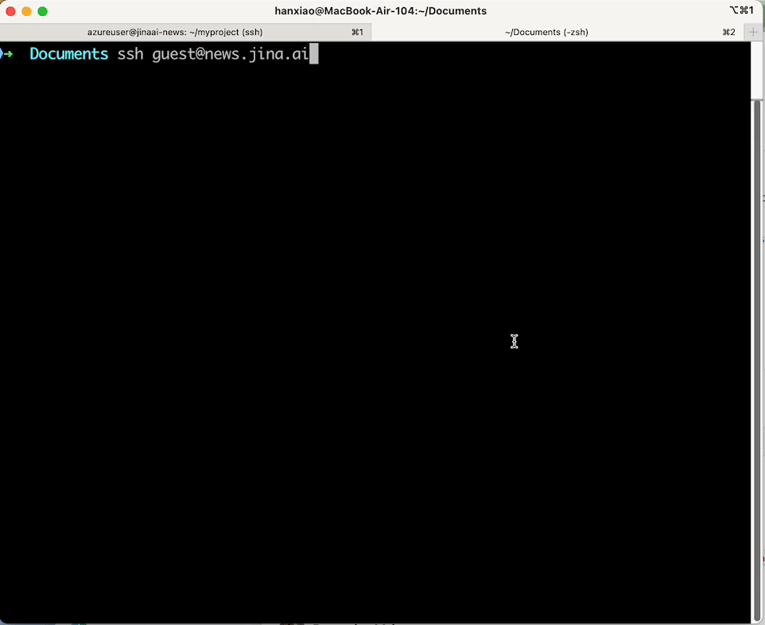

# terminal-news
Access [Jina AI news](https://jina.ai/news) via `ssh guest@news.jina.ai`.

This project implements the TUI of the above ssh experience. It leverages `textual` and Ghost API (the CMS of Jina AI news) to render the news in the terminal.

## Demo

```bash
ssh guest@news.jina.ai
```

```text
Are you sure you want to continue connecting (yes/no/[fingerprint])? yes
```




## License
Apache 2.0
